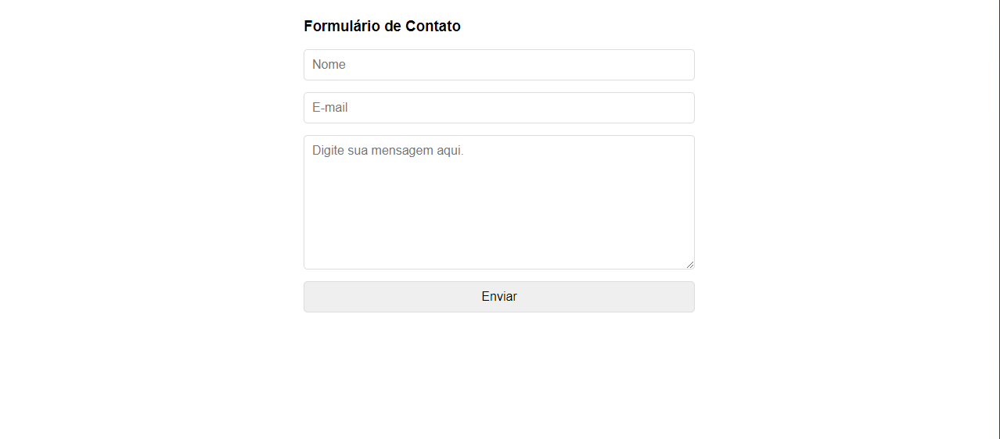

# Form PHP

### My first time using PHP and it was based on a video from 'Programador BR'!

### Here we have, 'Name', 'Email', and 'Message'... after that, it's send to your email all of this information. 

